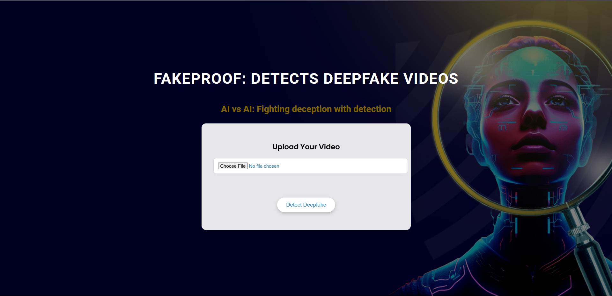
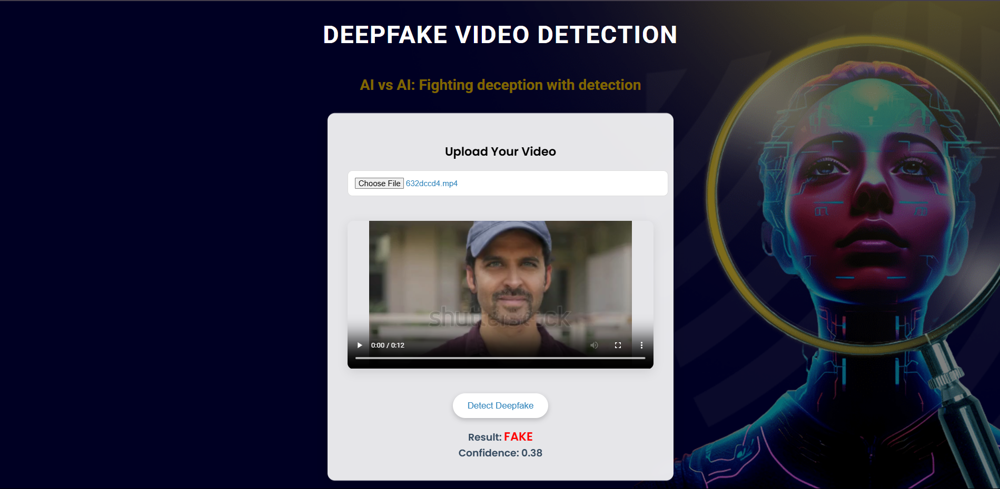

# Fakeproof: DeepFake Video Detector

## Overview
**DeepFake Video Detection** is a web-based application designed to detect whether a given video is **real or deepfake**.  
The system uses a **pre-trained deep learning model** hosted on a **Flask backend**, allowing users to upload videos and receive predictions through a simple web interface.

This project can be deployed **locally** or on **cloud platforms** with minimal configuration.


---

## Key Features
- ✅ Detects **DeepFake vs Real videos**
- ✅ Uses a **pre-trained deep learning model**
- ✅ Flask-based backend
- ✅ Simple and clean web interface
- ✅ Easy local and cloud deployment
- ✅ Modular and scalable structure

---

## Tech Stack
- **Backend:** Python, Flask  
- **Model:** Pre-trained Deep Learning Model  
- **Frontend:** HTML, CSS, JavaScript  
- **Environment:** Anaconda (Python 3.10)  
- **Libraries:** TensorFlow / PyTorch, OpenCV, NumPy, Flask  

---

## How It Works
1. User uploads a video through the web interface  
2. Backend extracts frames from the uploaded video  
3. Frames are preprocessed and passed to the trained model  
4. Model predicts whether the video is **Real** or **DeepFake**  
5. The prediction result is displayed on the UI  

---

## Model Details
- Trained on labeled **real and deepfake video datasets**
- Uses **frame-level feature extraction**
- Aggregates predictions across multiple frames
- Optimized for **fast and efficient inference**

---

## Use Cases
- Media authentication
- Fake news detection
- Digital forensics
- Social media content moderation
- Academic and research applications

---

## Environment Setup

Make sure Anaconda is installed and launch anaconda prompt and navigate to root directory in the anaconda prompt

create venv

```shell
conda create -n deepfakedetection python=3.10
```

Activate

```shell
conda activate deepfakedetection 
```

In order to set your environment up to run the code here, first install all requirements:

```shell
pip install -r requirements.txt
```

run the app.py file 

```shell
python app.py
```

Once you see this url - http://127.0.0.1:5000/ in logs, open it in browser.

Now your setup is ready.

---

## Screenshots

**Entry Interface**


**Working**


